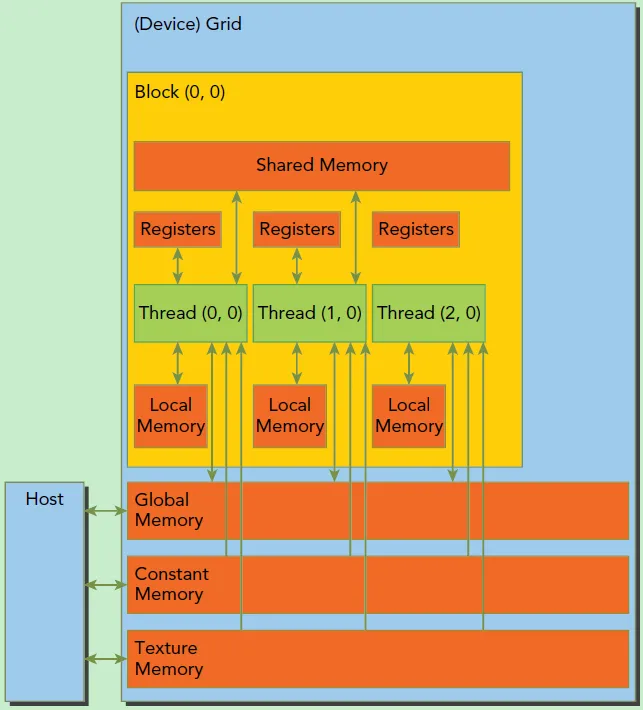
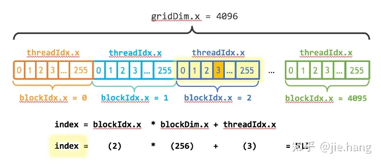

# cuda_basic_tutorial

## cuda基础

GPU并不是一个独立运行的计算平台，而需要通过PCIe总线与CPU协同工作，是一个**异构模型**

GPU存在很多核心，线程轻量级；cpu线程重量级，上下文切换开销大，因此两者互补能发挥最大功效（cpu处理逻辑复杂的串行程序；gpu处理数据密集型并行计算程序）

典型cuda工作流：

1. 分配host内存，并进行数据初始化；
2. 分配device内存，并从host将数据拷贝到device上；
3. 调用CUDA的核函数（**kernel**）在device上完成指定的运算；
4. 将device上的运算结果拷贝到host上；
5. 释放device和host上分配的内存。

kernel是device上线程并行执行的函数，用`__global__`声明，需要<<<grid, block>>>来指定kernel执行的线程数量。

在cuda中，每个线程会分配唯一`thread_id`，存储在kernel内置变量`threadIdx`中

cuda使用函数类型限定词区分host和device调用的函数

- `__global__`：在device上执行，从host中调用（一些特定的GPU也可以从device上调用），返回类型必须是void，不支持可变参数参数，不能成为类成员函数。注意用__global__定义的kernel是**异步**的，这意味着host不会等待kernel执行完就执行下一步。
- `__device__`：在device上执行，单仅可以从device中调用，不可以和__global__同时用。
- `__host__`：在host上执行，仅可以从host上调用，一般省略不写，不可以和__global__同时用，但可和__device__同时调用，此时函数会在device和host都编译。

kernel在device上执行时启动很多线程，一个kernel所启动的所有线程称为一个**网格**（grid），而网格又可以分为很多**线程块**(block)，一个线程块里有很多线程，如图所示


一个线程使用`(blockIdx, threadIdx)`来唯一标识，这些都是`dim3`类型变量，如上图的thread`(1,1)`满足

```c
blockIdx.x = 1
blockIdx.y = 1
threadIdx.x = 1
threadIdx.y = 1
```

一个线程块上的线程放在一个流式多处理器（streaming multiprocessor, **SM**）上，但单个SM资源有限，所以线程块中线程数是受限制的，当代gpu是1024个。注意：`gird`只是逻辑层，真正执行物理层还是SM，它采用**SIMT**（single instruction multiple threads）架构，基本执行单元是线程束（warps），32个线程/线程束。换句话说，kernel的所有线程在物理层**不一定**同时并发。

此外，由于SM的实际执行单元线程束包含32个线程，所以block大小一般设置为32的倍数

## cuda内存模型



每个线程有自己的私有内存（`local memory`），每个线程块有一份共享内存（`shared memory`）。此外，所有线程都可以访问全局内存（`global memory`）和一些只读内存块（常量内存`constant memory`和纹理内存`texture memory`）

在写程序方面，cuda6.0前需要分别申请host和device内存，CUDA 6.0后引入了**统一内存**（unified memory）来共同管理两边的内存并自动数据传输，`cudaMallocManaged(void **devPtr, size_t size, unsigned int flag=0);`

## 实战演练——以add为例

### 单线程add

```c++
// add_one_thread.cu
#include <math.h>  // function to add the elements of two arrays

#include <iostream>

// CUDA Kernel function to add the elements of two arrays on the GPU
__global__ void add(int n, float *x, float *y) {
  for (int i = 0; i < n; i++) {
    y[i] = x[i] + y[i];
  }
}

int main(void) {
  int N = 1 << 20;  // 1M elements
  float *x, *y;
  cudaMallocManaged(&x, N * sizeof(float));
  cudaMallocManaged(&y, N * sizeof(float));
  for (int i = 0; i < N; i++) {
    x[i] = 1.0f;
    y[i] = 2.0f;
  }
  // Run kernel on 1M elements on the GPU
  add<<<1, 1>>>(N, x, y);
  // Wait for GPU to finish before accessing on host
  cudaDeviceSynchronize();
  // Check for errors (all values should be 3.0f)
  float maxError = 0.0f;
  for (int i = 0; i < N; i++) {
    maxError = fmax(maxError, fabs(y[i] - 3.0f));
  }
  std::cout << "Max error: " << maxError << std::endl;
  // Free memory
  cudaFree(x);
  cudaFree(y);
  return 0;
}
```

使用nvcc编译并使用nvprof查看运行速度

```bash
nvcc add_one_thread.cu -o add_one_thread
nvprof ./add_one_thread

# 输出如下：
==8732== NVPROF is profiling process 8732, command: .\add_one_thread
Max error: 0
==8732== Profiling application: .\add_one_thread
==8732== Profiling result:
            Type  Time(%)      Time     Calls       Avg       Min       Max  Name
 GPU activities:  100.00%  64.451ms         1  64.451ms  64.451ms  64.451ms  add(int, float*, float*)
 ...
```

### 单block多线程add

我们将add调用改为`add<<<1, 256>>>(N, x, y);`，表示使用一个block，一个block有256线程

这么修改后，我们需要修改kernel函数，让每一个线程**根据自己的index**只做部分加的工作，我们将add改为这样

```c++
__global__ void add(int n, float *x, float *y) { 
  int index = threadIdx.x; 
  int stride = blockDim.x; 
  for (int i = index; i < n; i += stride) {
    y[i] = x[i] + y[i];
  }
}
```

随后nvprof发现时间从原来的60+ms变成了1.7ms！

```bash
==13272== NVPROF is profiling process 13272, command: .\add_one_block
Max error: 0
==13272== Profiling application: .\add_one_block
==13272== Profiling result:
            Type  Time(%)      Time     Calls       Avg       Min       Max  Name
 GPU activities:  100.00%  1.7198ms         1  1.7198ms  1.7198ms  1.7198ms  add(int, float*, float*)
```

### 多block并行操作

我们将add调用更改

```c++
int blockSize = 256;
int numBlocks = (N + blockSize - 1) / blockSize;  // +blocksize-1是为了向上取整
add<<<numBlocks, blockSize>>>(N, x, y);
```

然后kernel函数再次更改，这次每个线程需要做的事情更少了

```c++
__global__ void add(int n, float *x, float *y){ 
  int index = blockIdx.x * blockDim.x + threadIdx.x; 
  int stride = blockDim.x * gridDim.x; 
  for (int i = index; i < n; i += stride) {
    y[i] = x[i] + y[i];
  }
}
```

index和stride是如何计算的呢？请参考下图，



随后再次nvprof，时间直接降低到了37us！

```bash
==9208== NVPROF is profiling process 9208, command: .\add_multi_blocks
Max error: 0
==9208== Profiling application: .\add_multi_blocks
==9208== Profiling result:
            Type  Time(%)      Time     Calls       Avg       Min       Max  Name
 GPU activities:  100.00%  37.953us         1  37.953us  37.953us  37.953us  add(int, float*, float*)
```
